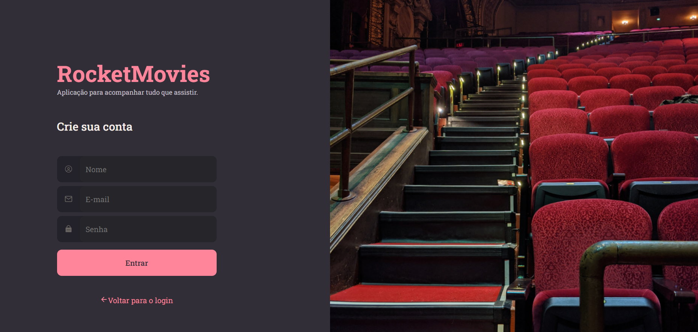
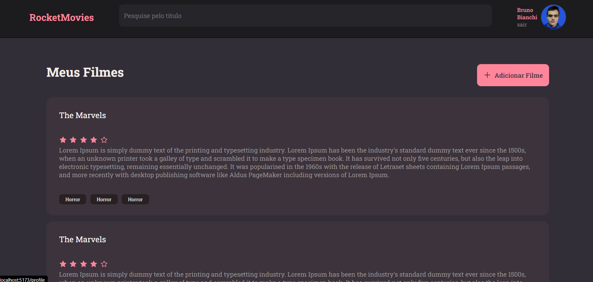
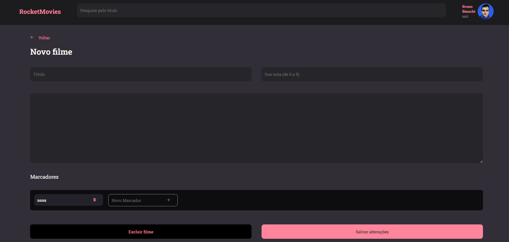
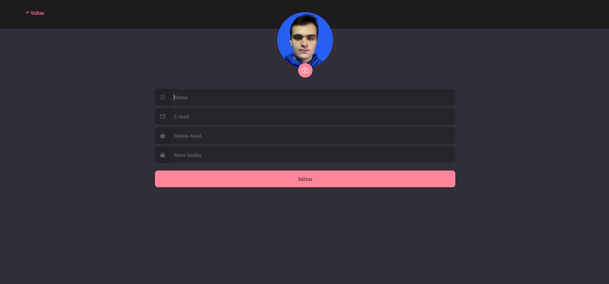
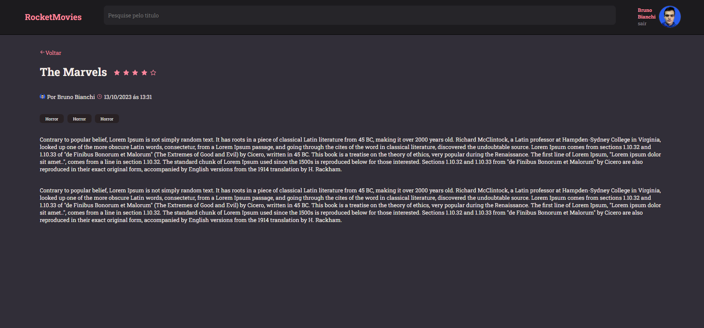

<h1 align="center"> Rocketmovies - Front-end </h1>
<p align="center">Listar seus filmes preferidos!</p>

<h4 align="center">Versão 1.0</h4>
<p align="center">
<a href="#sobre">Sobre</a>&nbsp;&nbsp;&nbsp;|&nbsp;&nbsp;&nbsp;
<a href="#telas">Telas</a>&nbsp;&nbsp;&nbsp;|&nbsp;&nbsp;&nbsp;
<a href="#tecnologias">Tecnologias</a>&nbsp;&nbsp;&nbsp;|&nbsp;&nbsp;&nbsp;
<a href="#layout">Layout</a>&nbsp;&nbsp;&nbsp;|&nbsp;&nbsp;&nbsp;
<a href="#instalação">Instalação</a>&nbsp;&nbsp;&nbsp;
<br>


## Sobre

O Rocketmovies é uma aplicação para você  listar seus filmes preferidos.!

**OBS:** Esta é a versão Front-end do projeto.


## Telas
Esse projeto foi desenvolvido as seguintes telas:

- Tela de autenticação de usuarios 
- Tela de Cadastro de usuarios
- Tela de update de usuarios
- Tela listagem de filmes
- Tela de visualização de filme
- Tela cadastro de novos filmes

<p align="center">
  
  
  
  
  
  
</p>


[1.1]: http://i.imgur.com/tXSoThF.png (texto título)
## Tecnologias
Esse projeto foi desenvolvido com as seguintes tecnologias:

- Javascript
- React
- Vite
- Styled Components
- Git e Github


## Layout

Link do layout usado no projeto:

- [Layout Figma](https://www.figma.com/file/UObYagRzmvi5PY4HhmzEHM/RocketMovies/duplicate?type=design&node-id=0-1&mode=design)

## Instalação 

Para clonar e executar esta aplicação, você precisará do [Git](https://git-scm.com/). A partir de sua linha de comando:

```bash
# Clone este repositório
$ git clone git@github.com:BrunoBianchi13/food-explorer.git

# Entre no repositório
$ cd food-explorer

# Instale as package.json
$ npm install

# OBS: para logar como Admin, Email: "Admin" Senha: "123"
```


## 💻 Projeto


- [Acesse o projeto completo](https://foodexplorer-api-3zw2.onrender.com)


<p align="center">
Feito by Bruno Bianchi
</p>